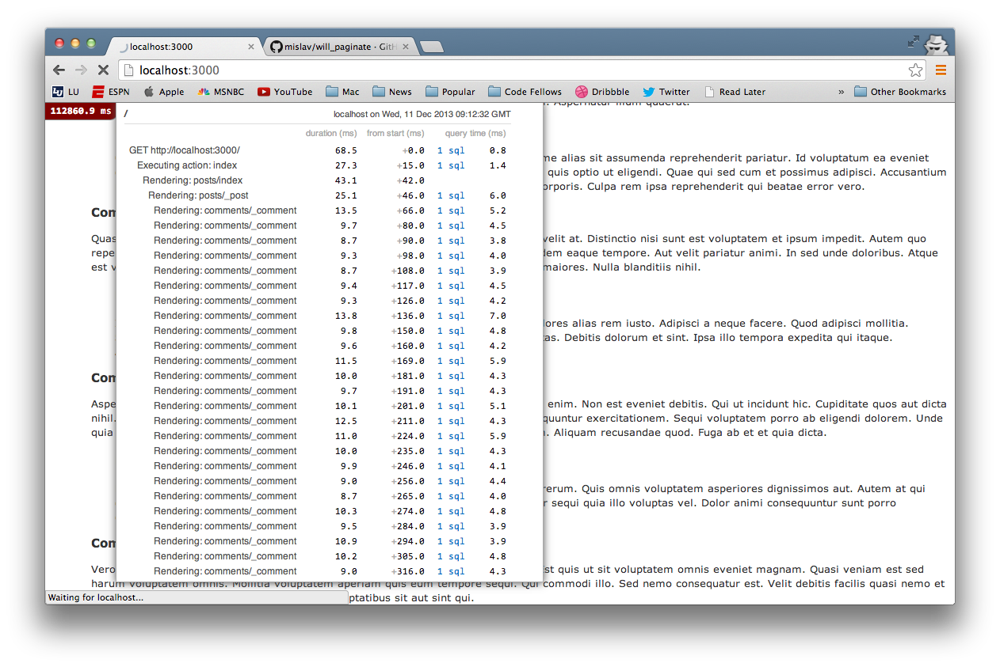
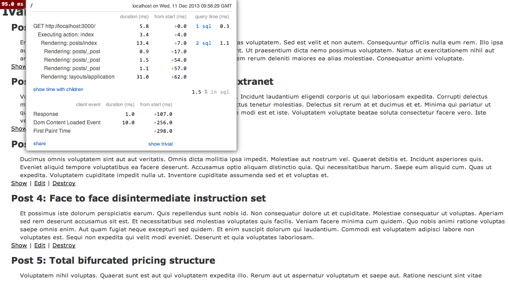

# Ivan_the_terribles_blog-performance

By [Phil Worthington](https://github.com/philworthington).

## Description
**Ivan_the_terribles_blog-performance** is an example blog built in Rails that originally had major performance issues such as rendering up to 10,000 comments on a single page and many queries of the database.

## Steps to resolve performance issues

1. Installed MiniProfiler gem to monitor performance in the browser.

2. Moved all comments for a specific post to the post's show page.

3. Paginated the posts index - showing 25 posts per page.

4. Paginated the posts show - showing 10 comments and 10 replies per page.

5. Used eager loading in the comments index action for fewer database queries for comments and replies.

post_time = (posts on the page) / (ms to load page)
post_time = 25 / 625.4ms = .039

cache_miss = time will be found by restarting all servers, and loading "/" a few times to get an average from Chrome inspector.

cache_miss = 560ms

cache_hit = time will be found by reloading that same page a few times to get an average from Chrome inspector.

cache_hit = 98ms

## Information

Screenshot below:

Orignal:

Amended:

## License

MIT: http://philworthington.mit-license.org
