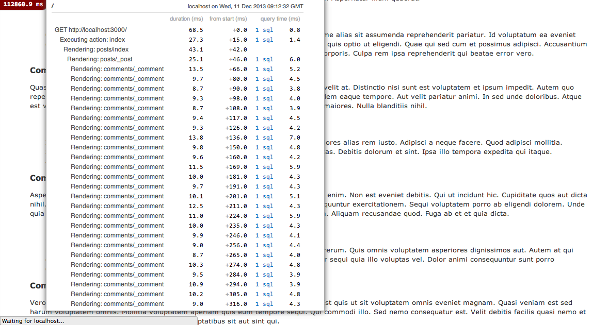

# Ivan_the_terribles_blog-performance

By [Phil Worthington](https://github.com/philworthington).

## Description
**Ivan_the_terribles_blog-performance** is an example blog built in Rails that originally had major performance issues such as rendering up to 10,000 comments on a single page and many queries of the database.

## Usage

## Information

Screenshot below:

## License

MIT: http://philworthington.mit-license.org
